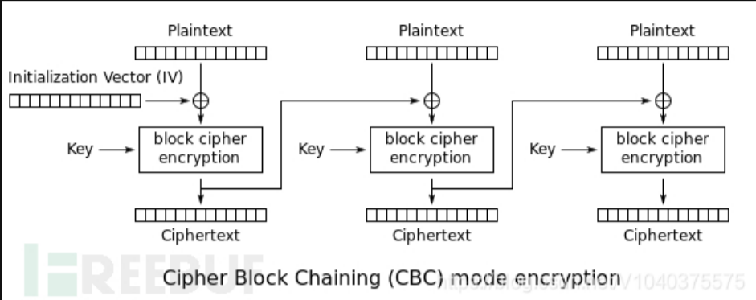

# AES-CBC反转攻击

在一些特定情况下才能使用



```
Plaintext：明文
IV：初始化向量
Ciphertext：密文
key：密钥
```

```
加密步骤：
1、先将明文分组，十六个字符一组(常见)，不足16个的特殊字符进行填充
2、生成IV和key
3、将第一组Plaintext与IV异或
4、用密钥对第三步的密文进行加密
5、将第4步的密文与第二组明文进行异或
6、再次用密钥对第5步的密文进行加密
7、重复第4，5，6步直到处理完最后一组数据
8、然后IV和最后一次的密文拼接，从而获得最后的加密结果


解密步骤：
1、从密文中将IV和密文数据分离
2、然后使用key对密文数据进行解密，再与IV异或
3、再对第2步的结果使用key解密，再与2中的密文异或
4、重复2、3得到Plaintext
```

```
异或有一个特性：
任意值与自己本身做异或运算的结果都是0，任意值与0做异或运算的结果都是自己。本身a^b=c，a^a则为空，但是a^a^任意字母=任意字母。
```

字节反转：

```
在CBC解密中，核心是控制上一个密文来对当前明文改变。A是第一组的密文，B是第二组被解密的密文（未异或），C是明文。C=A^B。那么B=C^A，且A^B^C=0。如果我们更改A，A为我们可控的密文，C=A^B,如果我们使A=B^X，B=C^A,所以A=C^A^X,C=C^A^X^B=B^X^B=X。这里X是我们需要的任意字符，这便是CBC字节反转攻击的核心，这样一来C的明文就完全可控了。
```

IV已知：

```
当我们破坏掉密文的第一组时，同样明文的第一组在解密的时候就并不是原来的明文了（可能会导致解密失败），这个时候我们需要修复初始向量IV，给它一个新的值。
newPlaintext,Plaintext
Ciphertext,newCiphertext   ----这是已经经过key解密的密文
newIV,IV
目的就是要使得：Plaintext=newIV^newCiphertext

过程：
IV^newPlaintext=newCiphertext
newIV^Plaintext=newCiphertext
所以：newIV=IV^newPlaintext^Plaintext
这样我们就能够对明文进行构造了
```

给两个例题:

### flipPin（H&NCTF2024）

源码

```py
from flask import Flask, request, abort
from Crypto.Cipher import AES
from Crypto.Random import get_random_bytes
from Crypto.Util.Padding import pad, unpad
from flask import Flask, request, Response
from base64 import b64encode, b64decode

import json

default_session = '{"admin": 0, "username": "user1"}'
key = get_random_bytes(AES.block_size)


def encrypt(session):
    iv = get_random_bytes(AES.block_size)
    cipher = AES.new(key, AES.MODE_CBC, iv)
    return b64encode(iv + cipher.encrypt(pad(session.encode('utf-8'), AES.block_size)))


def decrypt(session):
    raw = b64decode(session)
    cipher = AES.new(key, AES.MODE_CBC, raw[:AES.block_size])
    try:
        res = unpad(cipher.decrypt(raw[AES.block_size:]), AES.block_size).decode('utf-8')
        return res
    except Exception as e:
        print(e)

app = Flask(__name__)

filename_blacklist = {
    'self',
    'cgroup',
    'mountinfo',
    'env',
    'flag'
}

@app.route("/")
def index():
    session = request.cookies.get('session')
    if session is None:
        res = Response(
            "welcome to the FlipPIN server try request /hint to get the hint")
        res.set_cookie('session', encrypt(default_session).decode())
        return res
    else:
        return 'have a fun'

@app.route("/hint")
def hint():
    res = Response(open(__file__).read(), mimetype='text/plain')
    return res


@app.route("/read")
def file():

    session = request.cookies.get('session')
    if session is None:
        res = Response("you are not logged in")
        res.set_cookie('session', encrypt(default_session))
        return res
    else:
        plain_session = decrypt(session)
        if plain_session is None:
            return 'don\'t hack me'

        session_data = json.loads(plain_session)

        if session_data['admin'] :
            filename = request.args.get('filename')

            if any(blacklist_str in filename for blacklist_str in filename_blacklist):
                abort(403, description='Access to this file is forbidden.')

            try:
                with open(filename, 'r') as f:
                    return f.read()
            except FileNotFoundError:
                abort(404, description='File not found.')
            except Exception as e:
                abort(500, description=f'An error occurred: {str(e)}')
        else:
            return 'You are not an administrator'

if __name__ == "__main__":
    app.run(host="0.0.0.0", port=9091, debug=True)
```

简单审计一下代码，就是通过AES设置seesion然后通过文件任意读计算Pin码从而RCE

第一步就是AES-CBC翻转攻击

``` 
'''
{"admin": 0, "us
ername": "user1"
}
'''
# import base64
# import urllib.parse

cipher = base64.b64decode('NGcMAGVYo/XqWTybD4TDonxbwAFSepn0xy0rzDrsIpylvnsjq5AobLr8uVhraQLNeTJMfe7usXGA6KDM+0uUIg=='.encode('utf-8'))
x = cipher[0:10]+bytes([ord(chr(cipher[10]))^ord('1')^ord('0')])+cipher[11:]
x = base64.b64encode(x).decode('utf-8')
print(x)

# NGcMAGVYo/XqWT2bD4TDonxbwAFSepn0xy0rzDrsIpylvnsjq5AobLr8uVhraQLNeTJMfe7usXGA6KDM+0uUIg==
```

题目后面的就不贴出来了，就是简单读文件算PIN

### 第二题

``` php
<!DOCTYPE html PUBLIC "-//W3C//DTD XHTML 1.0 Transitional//EN" "http://www.w3.org/TR/xhtml1/DTD/xhtml1-transitional.dtd">
<html>
<head>
<meta http-equiv="Content-Type" content="text/html; charset=utf-8" />
<title>Login Form</title>
<link href="static/css/style.css" rel="stylesheet" type="text/css" />
<script type="text/javascript" src="static/js/jquery.min.js"></script>
<script type="text/javascript">
$(document).ready(function() {
	$(".username").focus(function() {
		$(".user-icon").css("left","-48px");
	});
	$(".username").blur(function() {
		$(".user-icon").css("left","0px");
	});

	$(".password").focus(function() {
		$(".pass-icon").css("left","-48px");
	});
	$(".password").blur(function() {
		$(".pass-icon").css("left","0px");
	});
});
</script>
</head>

<?php
define("SECRET_KEY", '9999999999999999');
define("METHOD", "aes-128-cbc");
session_start();

function get_random_iv(){
    $random_iv='';
    for($i=0;$i<16;$i++){
        $random_iv.=chr(rand(1,255));
    }
    return $random_iv;
}

function login($info){
    $iv = get_random_iv();
    $plain = serialize($info);
    $cipher = openssl_encrypt($plain, METHOD, SECRET_KEY, OPENSSL_RAW_DATA, $iv);
    $_SESSION['username'] = $info['username'];
    setcookie("iv", base64_encode($iv));
    setcookie("cipher", base64_encode($cipher));
}

function check_login(){
    if(isset($_COOKIE['cipher']) && isset($_COOKIE['iv'])){
        $cipher = base64_decode($_COOKIE['cipher']);
        $iv = base64_decode($_COOKIE["iv"]);
        if($plain = openssl_decrypt($cipher, METHOD, SECRET_KEY, OPENSSL_RAW_DATA, $iv)){
            $info = unserialize($plain) or die("<p>base64_decode('".base64_encode($plain)."') can't unserialize</p>");
            $_SESSION['username'] = $info['username'];
        }else{
            die("ERROR!");
        }
    }
}

function show_homepage(){
    if ($_SESSION["username"]==='admin'){
        echo '<p>Hello admin</p>';
        echo '<p>Flag is ctf{123cbcchange}</p>';
    }else{
        echo '<p>hello '.$_SESSION['username'].'</p>';
        echo '<p>Only admin can see flag</p>';
    }
    echo '<p><a href="loginout.php">Log out</a></p>';
}

if(isset($_POST['username']) && isset($_POST['password'])){
    $username = (string)$_POST['username'];
    $password = (string)$_POST['password'];
    if($username === 'admin'){
        exit('<p>admin are not allowed to login</p>');
    }else{
        $info = array('username'=>$username,'password'=>$password);
        login($info);
        show_homepage();
    }
}else{
    if(isset($_SESSION["username"])){
        check_login();
        show_homepage();
    }else{
        echo '<body class="login-body">
                <div id="wrapper">
                    <div class="user-icon"></div>
                    <div class="pass-icon"></div>
                    <form name="login-form" class="login-form" action="" method="post">
                        <div class="header">
                        <h1>Login Form</h1>
                        <span>Fill out the form below to login to my super awesome imaginary control panel.</span>
                        </div>
                        <div class="content">
                        <input name="username" type="text" class="input username" value="Username" onfocus="this.value=\'\'" />
                        <input name="password" type="password" class="input password" value="Password" onfocus="this.value=\'\'" />
                        </div>
                        <div class="footer">
                        <input type="submit" name="submit" value="Login" class="button" />
                        </div>
                    </form>
                </div>
            </body>';
    }
}
?>
</html>

```

阅读源代码，我们可以知道，只有admin用户才能读取flag，但是admin用户又不允许登录。虽然相互矛盾，由于题目用到了aes的cbc模式加密，所以我们可以利用cbc字节翻转攻击来得到我们想要的明文。

``` 
分组：
a:2:{s:8:"userna
me";s:5:"admix";
s:8:"password";s
:2:"123";}　
```

因此我们只需要将"x"字节翻转为"n"即可得到flag。

根据我们得到的关系，已知只需修改前一组密文即可。

$newcipher[13]=chr(ord(13) ^ ord(‘x’) ^ ord(‘n’))

这时我们就会得到

a:2:{s:8:“username”;s:5:“admin”;s:8:“password”;s:3:“123”;

但是由于前一组密文被修改了 所以前一组的明文会出现乱码，因此接下来我们再生成新的iv将前一组明文改回a:2:{s:8:"userna 即可得到flag。

```
#-*- coding:utf8 -*-
import base64
import urllib.parse

# a:2:{s:8:"userna
# me";s:5:"admiN";
# s:8:"password";s
# :6:"123";}
 
#原始cipher
ciphertext = 'w1uvgfzxxuYHA%2Bo08ZL%2BCefhwr2jHuwglOIBAh8cP1w5TCiCmY0Yy%2BQxelAl9%2B%2FiZeRvLD7UjzlF58bTGFZ%2BWQ%3D%3D'

cipher = base64.b64decode(urllib.parse.unquote(ciphertext))
array_cipher = bytearray(cipher)
array_cipher[13] =  array_cipher[13]^ ord('N') ^ ord('n')
#print(array_cipher)
print('newCipher:',urllib.parse.quote(base64.b64encode(array_cipher)))

#解密后的明文base64
decode_plain = base64.b64decode('sxvY7wUlyPgC+/iV7InfjG1lIjtzOjU6ImFkbWluIjtzOjg6InBhc3N3b3JkIjtzOjM6IjEyMyI7fQ==')
#原始iv
iv = base64.b64decode(urllib.parse.unquote('1HxERxo2%2FTuymbrPoVDB%2Bw%3D%3D'))
#原始明文
plain = 'a:2:{s:8:"userna'

newiv = list(iv)

for i in range(16):
    newiv[i] = (ord(plain[i].encode('utf-8')) ^ iv[i] ^ decode_plain[i])

newiv = bytes(newiv)

print('newiv:',urllib.parse.quote(base64.b64encode(newiv)))

```

